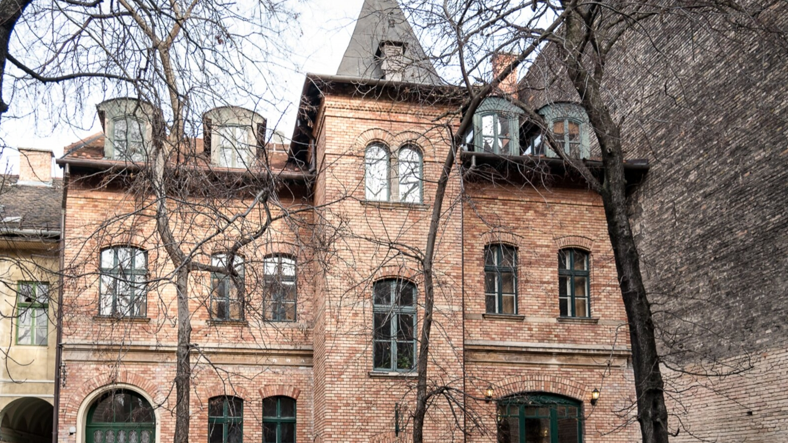

# Róth Miksa Emlékház
## Az épület története

A Nefelejcs utca 26. szám alatti épület eredetileg Gelb Sámuel bútorgyárosé volt. Róth Miksa 1911-ben vásárolta meg, majd Pecz Samu tervei alapján építtette át. Ekkor emelték a belső udvarban a három szintes épületet a műhelyek számára.

Az épületek a második világháború során előbb német, majd szovjet katonai térképészeti irodának adtak helyet. 1948-tól a Honvéd Petőfi Akadémia működött itt, ahol politikai tiszteket képeztek a Magyar Néphadsereg számára. Az épület egyre jobban leromlott, az Országos Szakipari Vállalat műhelye lett, aztán szükséglakásként szolgált. Az utcai épület emeleti részén, három szobát hagytak meg az államosítás után Róth Miksa özvegyének, Walla Jozefának valamint Erzsébet, Amália és József nevű gyermekeinek.

A család a rendszerváltás után, részben Ráday Mihály közbenjárására, az apa hagyatékát Erzsébetvárosnak ajándékozta, hogy szülőházukból Róth Miksa Emlékház nyíljék. A múzeum hosszas munka után 1999 novemberében nyílt meg a látogatók számára.

