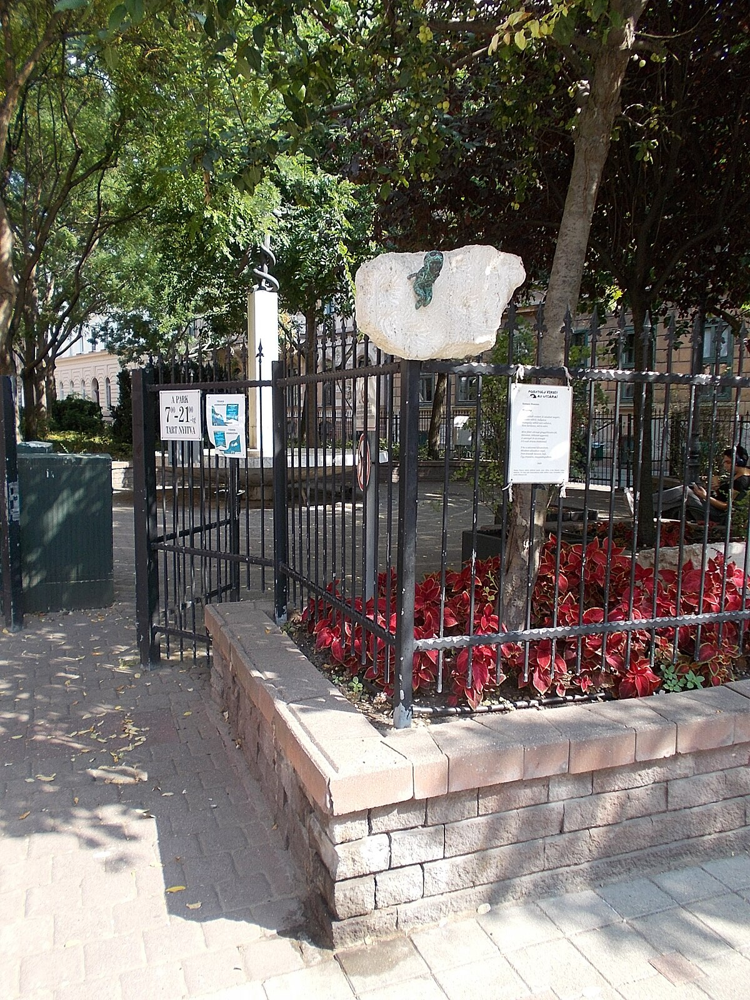

# Szenes Hanna park
## Emléke

Nevét szinte az egész világon ismerik. Műveit húsznál több nyelvre fordították le és ötven országban adták ki. Izrael államban, mint nemzeti hős sorsa és helytállása tananyag és az ottani érettségin is tétel.

Emlékét Budapest VII. kerületében a Szenes Hanna park neve őrzi, ahol 2020-ban nőnapon elhelyezték Kolodko Mihály őt ábrázoló miniszobrát is. A Széna téren – közel a Margit körúti fogházhoz, ahol kivégezték –, a Széna téri emlékparkban 2022-ben állították fel bronz mellszobrát, Fáskerti Zsófia alkotását. Izraelben utcák viselik a nevét. Dombóváron teret neveztek el róla.

