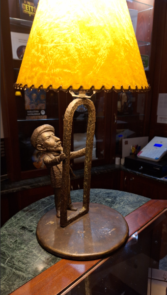

# Róth Miksa miniszobor
Róth Miksa a magyar üvegművészet legismertebb alkotója volt. Nevéhez fűződik számos középület, többek között az Országház (1., 2.), a Levéltár (1., 2., 3., 4.), vagy a marosvásárhelyi Kultúrpalota (1., 2., 3.)  ólomüveg ablakainak készítése.

Róth Miksa lakóháza mind a mai napig áll. Élete 33 évét töltött itt a művész, családjával. Kolodko Róth Miksa miniszobra, amiről nagyon kevesen tudnak, itt, Róth Miksa otthonának földszinti dolgozószobájában található. Róth Miksa egy ablakkeretet tart a kezében, és éppen azon vacillál, hogy mi legyen a témája a keretbe kerülő megfestett ólomüvegnek. Közben felülről érkezik a napfénynek álcázott lámpafény, egyrészt ezzel jelezve a művészi heurékát/megvilágosodás pillanatát, másrészt Kolodko igyekszik rávilágítani arra, hogy Róth Miksa kitörölhetetlenül a napfény művésze (üvegablakai nem élnének a napfény nélkül). Kolodko azon felül, hogy egyértelművé tette alkotásával Róth Miksa munkásságának üzenetét, arra is odafigyelt, hogy a miniszobor beépüljön a dolgozószoba vizualitásába: belépve a helyiségbe nem csak egy asztalra helyezett Róth Miksát ábrázoló asztali lámpát láthatunk jobbra a pulton, hanem a szoba bal oldalán, szintén egy pulton található könnyed öltözetű lámpabúrát tartó hölgyeménnyel Kolodko egyfajta párhuzamos harmóniát teremtett meg.
### forrás:[ERREARRA](https://www.errearra.org/kolodko-roth-miksa)
