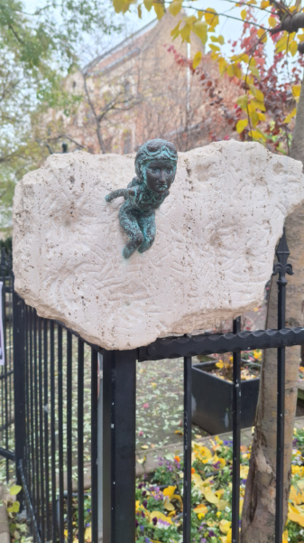

# Szenes Hanna miniszobor
Az erzsébetvárosi Szenes Hanna téren került elhelyezésre Kolodko Mihály egyik alkotása, a Szenes Hanna miniszobor. 

Szenes Hanna Magyarországon született egy zsidó családban. Miután kitűnően érettségizett, Palesztinába emigrált. Itt szembesült a II. világháború borzalmaival. A verseket is író hölgy 1943-ban csatlakozott a brit hadsereghez ejtőernyősként.

Egy évvel később Magyarországra küldték, hogy megakadályozza a magyar zsidók deportálását. Sajnos már a határon elfogták és napokon keresztül kínozták. Azonban a 23 éves fiatal nő nem volt hajlandó elárulni semmit. 1944-ben halálra ítélték, és a Margit Körúti Katonai Fogházban kivégezték. 
### Forrás:[Szallas.hu](https://szallas.hu/programok/kolodko:-szenes-hanna-miniszobor-budapest-p9028)
